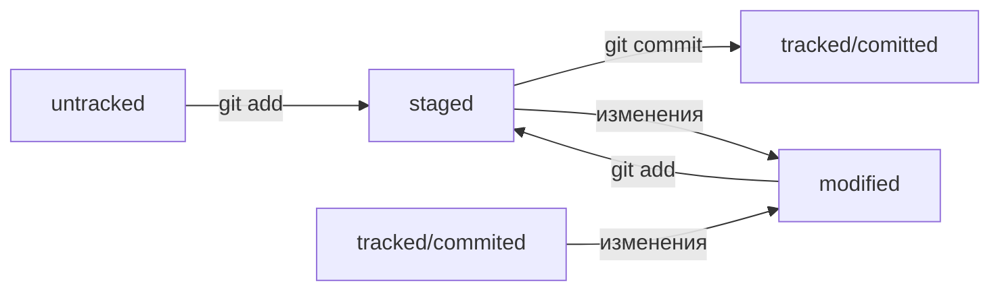

# Конспект по курсу обучения работе с Git

## Работа с локальным репозиторием
### Инициализировать репозиторий
1. Перейдите в нужную папку: `cd <папка с репозиторием>`
1. Выполните команду: `git init`
Если вы случайно сделали Git-репозиторем не ту папку, удалите скрытую подпаку `.git`: `rm -rf .git`
### Проверить состояние репозитория
В папке с репозиторием выполните команду: `git status`
### Добавить файлы в репозиторий
1. Подготовьте файлы к сохранению: `git add`
1. Сохраните изменения файлов: `git commit -m 'Комментарий к коммиту'`
### Посмотреть историю коммитов
1. В полном формате: в папке с репозиторием выполните команду `git log`
1. В сокращенном формате: выполните команду `git log --oneline`

## Работа с удаленным репозиторем
### Связать локальный и удаленный репозитории
1. Создайте удаленный репозиторий через веб-интерфейс GitHub;
1. Привяжите удаленный репозиторий к локальному: `git remote add origin git@github.com:%ИМЯ_АККАУНТА%/%ИМЯ_ПРОЕКТА%.git`
1. Убедитесь, что репозитории связаны: `git remote -v`
### Отправить изменения на удаленный репозиторий
1. Отправка изменений в первый раз: `git push -u origin master`
1. Отправка изменений в последующие разы: `git push`

## Работа с коммитами
### Идентификатор коммита
- Каждый коммит получает уникальный идентификатор - хеш.
- Git хеширует (преобразует) информацию о коммите с помощью алгоритма SHA-1.
- Git хранит таблицу соответствий `хеш → информация о коммите`.
- Все хеши и таблицу `хеш → информация о коммите` Git сохраняет в служебные файлы. Они находятся в скрытой папке .git в репозитории проекта.
### Лог коммита
Можно вызвать не только полный лог, но и сокращённый — это делается командой `git log --oneline`.  
В сокращённом логе выводятся сокращённые хеши — их можно использовать точно так же, как и полные.
#### Описание коммита содержит следующие элементы:
- Строка из цифр и латинских букв после слова commit — это хеш коммита;
- Author — имя автора и его электронная почта;
- Date — дата и время создания коммита;
- в конце находится сообщение коммита.
### Файл HEAD
Файл `HEAD` - Служебный файл, находится в папке `.git`. Указывает на коммит, который был сделан последним (самый новый). 

Внутри HEAD — ссылка на служебный файл: `refs/heads/master` (или `refs/heads/main` в зависимости от названия ветки). Этот файл содержит хеш последнего коммита.

В командах Git dместо хеша последнего коммита можно писать слово `HEAD`.

## Статусы файлов в Git
- **untracked** - Git не следит за изменениями в файле.
- **tracked** -статус всех файлов, отслеживаемых Git.
- **staged** - в этот статус файл переходит после выполнения `git add`.
- **modified** - файл был изменён.

